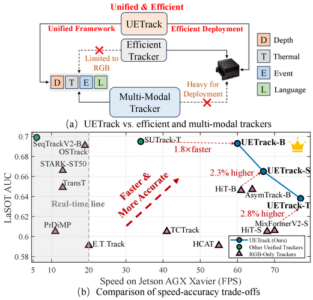
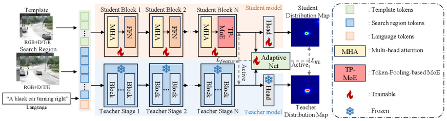

# UETrack

> [**UETrack: A Unified and Efficient Framework for Single Object Tracking**](https://arxiv.org/abs/2603.01412)<br>
> accepted by CVPR2026<br>
> [Ben Kang](https://scholar.google.com.hk/citations?user=By9F6bwAAAAJ), [Jie Zhao](https://scholar.google.com/citations?user=Oi42Tc8AAAAJ), [Xin Chen](https://scholar.google.com.hk/citations?user=A04HWTIAAAAJ), Wanting Geng, Bin Zhang, [Lu Zhang](https://scholar.google.com/citations?user=bUtRE5UAAAAJ), [Dong Wang](http://faculty.dlut.edu.cn/wangdongice/zh_CN/index.htm), [Huchuan Lu](https://ice.dlut.edu.cn/lu/)

This is the official PyTorch implementation of **UETrack**, a unified and efficient framework for single object tracking.

UETrack is designed for practical deployment and supports five modalities in a single framework:
- RGB-based Tracking
- RGB-Depth Tracking
- RGB-Thermal Tracking
- RGB-Event Tracking
- RGB-Language Tracking

All released checkpoints, logs, and raw results can be downloaded from:
- [Checkpoints](https://huggingface.co/kangben258/UETrack/tree/main/uetrack/checkpoints)
- [Logs](https://huggingface.co/kangben258/UETrack/tree/main/uetrack/logs)
- [Raw Results](https://huggingface.co/kangben258/UETrack/tree/main/uetrack/raw_results)

## Highlights

### Unified and Efficient Tracking Framework

UETrack is a unified tracker that handles **RGB, Depth, Thermal, Event, and Language** inputs in a single efficient framework.  
It is built for real-world deployment and achieves strong speed-accuracy trade-offs across multiple platforms.



### Core Design

UETrack contains two key components:

- **Token-Pooling-based Mixture-of-Experts (TP-MoE)**  
  A lightweight expert mechanism that enhances representation ability for multi-modal inputs through similarity-driven soft assignment.

- **Target-aware Adaptive Distillation (TAD)**  
  An adaptive distillation strategy that selectively transfers supervision from the teacher model based on sample difficulty.



### Strong Performance

#### RGB-based Tracking

| Tracker       | LaSOT (AUC) | LaSOText (AUC) | TrackingNet (AUC) | GOT-10k (AO) |
|---------------|-------------|----------------|-------------------|--------------|
| **UETrack-B** | **69.2**    | **48.4**       | **82.7**          | **72.6**     |
| UETrack-S     | 66.9        | 47.9           | 81.4              | 71.1         |
| UETrack-T     | 63.4        | 42.2           | 78.9              | 65.3         |
| HiT-Base      | 64.6        | 44.1           | 80.0              | 64.0         |
| AsymTrack-B   | 64.7        | 44.6           | 80.0              | 67.7         |
| MixFormerV2-S | 60.6        | 43.6           | 75.8              | 61.9         |

#### Multi-Modal Tracking

| Tracker     | VOT-RGBD22 (EAO) | DepthTrack (F-score) | LasHeR (AUC) | RGBT234 (MSR) | VisEvent (AUC) | TNL2K (AUC) | OTB99 (AUC) |
|-------------|------------------|----------------------|--------------|---------------|----------------|-------------|-------------|
| **UETrack-B** | **68.3**       | **60.6**             | **55.5**     | **64.2**      | **59.2**       | **58.0**    | 61.3        |
| UETrack-S   | 66.5             | 58.9                 | 53.2         | 62.2          | 58.0           | 57.0        | 63.1        |
| UETrack-T   | 62.5             | 55.7                 | 48.2         | 59.3          | 54.4           | 54.4        | **64.8**    |

#### Speed

| Tracker       | GPU FPS | CPU FPS | AGX FPS | Params (M) | FLOPs (G) |
|---------------|---------|---------|---------|------------|-----------|
| UETrack-B     | 163     | 56      | 60      | 13         | 3.2       |
| UETrack-S     | 183     | 68      | 67      | 9          | 2.5       |
| UETrack-T     | 221     | **83**  | **77**  | 6          | 1.8       |
| HiT-Base      | 175     | 33      | 61      | -          | -         |
| SUTrack-T     | 100     | 23      | 34      | -          | -         |


## Install the environment
```
conda create -n uetrack python=3.10
conda activate uetrack
bash install.sh
```
* Add the project path to environment variables
```
export PYTHONPATH=<absolute_path_of_UETrack>:$PYTHONPATH
```

## Data Preparation
Put the tracking datasets in [./data](data). It should look like:

For RGB tracking:
   ```
   ${UETrack_ROOT}
    -- data
        -- lasot
            |-- airplane
            |-- basketball
            |-- bear
            ...
        -- got10k
            |-- test
            |-- train
            |-- val
        -- coco
            |-- annotations
            |-- images
        -- trackingnet
            |-- TRAIN_0
            |-- TRAIN_1
            ...
            |-- TRAIN_11
            |-- TEST
   ```
For Multi-Modal tracking:
   ```
   ${UETrack_ROOT}
    -- data
        -- depthtrack
            -- train
                |-- adapter02_indoor
                |-- bag03_indoor
                |-- bag04_indoor
                ...
        -- lasher
            -- trainingset
                |-- 1boygo
                |-- 1handsth
                |-- 1phoneblue
                ...
            -- testingset
                |-- 1blackteacher
                |-- 1boycoming
                |-- 1stcol4thboy
                ...
        -- RGB-T234
            |-- afterrain
            |-- aftertree
            |-- baby
            ...
        -- visevent
            -- train
                |-- 00142_tank_outdoor2
                |-- 00143_tank_outdoor2
                |-- 00144_tank_outdoor2
                ...
            -- test
                |-- 00141_tank_outdoor2
                |-- 00147_tank_outdoor2
                |-- 00197_driving_outdoor3
                ...
            -- annos
        -- tnl2k
            -- train
                |-- Arrow_Video_ZZ04_done
                |-- Assassin_video_1-Done
                |-- Assassin_video_2-Done
                ...
            -- test
                |-- advSamp_Baseball_game_002-Done
                |-- advSamp_Baseball_video_01-Done
                |-- advSamp_Baseball_video_02-Done
                ...
        -- lasot
            |-- airplane
            |-- basketball
            |-- bear
            ...
        -- otb_lang
            -- OTB_videos
                |-- Basketball
                |-- Biker
                |-- Bird1
                ...  
            -- OTB_query_train
                |-- Basketball.txt
                |-- Bolt.txt
                |-- Boy.txt
                ...  
            -- OTB_query_test
                |-- Biker.txt
                |-- Bird1.txt
                |-- Bird2.txt
                ...  
   ```

## Set project paths
Run the following command to set paths for this project
```
python tracking/create_default_local_file.py --workspace_dir . --data_dir ./data --save_dir .
```
After running this command, you can also modify paths by editing these two files
```
lib/train/admin/local.py  # paths about training
lib/test/evaluation/local.py  # paths about testing
```

### Train UETrack
The pretrained backbone and teacher models can be downloaded here [[HuggingFace]](https://huggingface.co/kangben258/UETrack/tree/main/uetrack/pretrained_models).
Modify the [MODEL.ENCODER.PRETRAIN_TYPE](./experiments/uetrack) field and the [TRAIN.TEACHER_PATH](./experiments/uetrack) field in the [***.yaml](./experiments/uetrack) file under experiments to the paths of the downloaded pretrained backbone and teacher checkpoint, respectively.

Then, run the following command:
```
python -m torch.distributed.launch --nproc_per_node 2 lib/train/run_training.py --script uetrack --config uetrack_base --save_dir .
```
(Optionally) Debugging training with a single GPU
```
python lib/train/run_training.py --script uetrack --config uetrack_base --save_dir . 
```

## Test and evaluate on benchmarks
### UETrack for RGB-based Tracking
- LaSOT
```
python tracking/test.py uetrack uetrack_base --dataset lasot --threads 2
python tracking/analysis_results.py # need to modify tracker configs and names
```
- GOT10K-test
```
python tracking/test.py uetrack uetrack_base --dataset got10k_test --threads 2
python lib/test/utils/transform_got10k.py --tracker_name uetrack --cfg_name uetrack_base
```
- TrackingNet
```
python tracking/test.py uetrack uetrack_base --dataset trackingnet --threads 2
python lib/test/utils/transform_trackingnet.py --tracker_name uetrack --cfg_name uetrack_base
```
- UAV123
```
python tracking/test.py uetrack uetrack_base --dataset uav --threads 2
python tracking/analysis_results.py # need to modify tracker configs and names
```
- NFS
```
python tracking/test.py uetrack uetrack_base --dataset nfs --threads 2
python tracking/analysis_results.py # need to modify tracker configs and names
```


### UETrack for Multi-Modal Tracking
- LasHeR
```
python ./RGBT_workspace/test_rgbt_mgpus.py --script_name uetrack --dataset_name LasHeR --yaml_name uetrack_base
# Through this command, you can obtain the tracking result. Then, please use the official matlab toolkit to evaluate the result. 
```
- RGBT-234
```
python ./RGBT_workspace/test_rgbt_mgpus.py --script_name uetrack --dataset_name RGBT234 --yaml_name uetrack_base
# Through this command, you can obtain the tracking result. Then, please use the official matlab toolkit to evaluate the result. 
```
- VisEvent
```
python ./RGBE_workspace/test_rgbe_mgpus.py --script_name uetrack --dataset_name VisEvent --yaml_name uetrack_base
# Through this command, you can obtain the tracking result. Then, please use the official matlab toolkit to evaluate the result. 
```
- TNL2K
```
python tracking/test.py uetrack uetrack_base --dataset tnl2k --threads 2
python tracking/analysis_results.py # need to modify tracker configs and names
```
- OTB99
```
python tracking/test.py uetrack uetrack_base --dataset otb99_lang --threads 0
python tracking/analysis_results.py # need to modify tracker configs and names
```
- DepthTrack
```
# The workspace needs to be initialized using the VOT toolkit first. 
cd Depthtrack_workspace
vot evaluate uetrack_base
vot analysis uetrack_base --nocache
```
- VOT-RGBD22
```
# The workspace needs to be initialized using the VOT toolkit first. 
cd VOT22RGBD_workspace
vot evaluate uetrack_base
vot analysis uetrack_base --nocache
```

## Test inference speed & FLOPs
```
python profile_model_uetrack.py --script uetrack --config uetrack_base
```

## Model Zoo
The trained models, and the raw tracking results are provided in the [model zoo](MODEL_ZOO.md)

## Contact
* Ben Kang (email:kangben@mail.dlut.edu.cn)

## Acknowledgments
This work is based on our previous work [SUTrack](https://github.com/chenxin-dlut/SUTrack), which is also a unified multi-modal tracker.

```
@inproceedings{uetrack,
  title={UETrack: A Unified and Efficient Framework for Single Object Tracking},
  author={Ben Kang, Jie Zhao, Xin Chen, Wanting Geng, Bin Zhang, Lu Zhang, Dong Wang, Huchuan Lu},
  booktitle=CVPR,
  year={2026}
}
```

